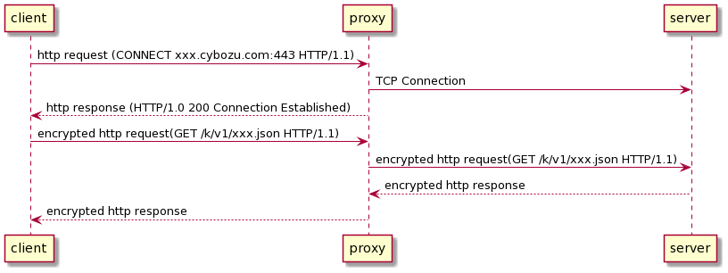

# Using an HTTP proxy

## Command-line interface

```shell
cli-kintone record <subcommand> --proxy <proxy URL>
```

| Variable  | Description                 |
| --------- | --------------------------- |
| `--proxy` | The URL of the proxy server |

## Environment variable

| Variable      | Description                                                                                |
| ------------- | ------------------------------------------------------------------------------------------ |
| `HTTPS_PROXY` | The URL of the proxy server<br/>The command-line option is prioritized over this variable. |

## Connection details

We use HTTP Tunneling for the request.

- The client sends `CONNECT` request to the proxy server
- The Proxy server creates a TCP connection to the destination server
- The client sends an encrypted request to the destination server via the proxy server



### refs.

- [Proxy servers and tunneling - HTTP | MDN](https://developer.mozilla.org/en-US/docs/Web/HTTP/Proxy_servers_and_tunneling#http_tunneling)
- [Issue #24 · kintone/js-sdk-ja](https://github.com/kintone/js-sdk-ja/issues/24#issuecomment-996485078)

## Implementation

We use [TooTallNate/proxy-agents](https://github.com/TooTallNate/node-https-proxy-agent) for this function.
