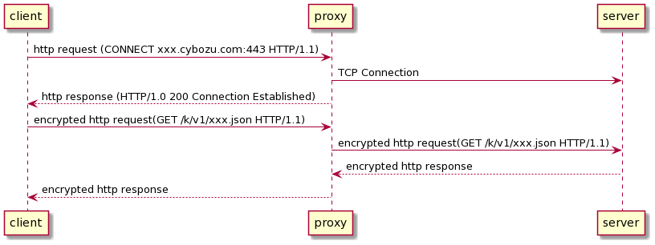

# HTTPプロキシの使用

## コマンドラインインターフェース

```shell
cli-kintone record <subcommand> --proxy <proxy URL>
```

| 変数      | 説明                  |
| --------- | --------------------- |
| `--proxy` | プロキシサーバーのURL |

## 環境変数

| 変数          | 説明                                                                             |
| ------------- | -------------------------------------------------------------------------------- |
| `HTTPS_PROXY` | プロキシサーバーのURL<br/>コマンドラインオプションがこの変数よりも優先されます。 |

## 接続の詳細

リクエストにはHTTPトンネリングを使用します。

- クライアントはプロキシサーバーに`CONNECT`リクエストを送信します
- プロキシサーバーは宛先サーバーへのTCP接続を作成します
- クライアントはプロキシサーバー経由で宛先サーバーに暗号化されたリクエストを送信します



### 参考資料

- [Proxy servers and tunneling - HTTP | MDN](https://developer.mozilla.org/en-US/docs/Web/HTTP/Proxy_servers_and_tunneling#http_tunneling)
- [Issue #24 · kintone/js-sdk-ja](https://github.com/kintone/js-sdk-ja/issues/24#issuecomment-996485078)

## 実装

この機能には[TooTallNate/proxy-agents](https://github.com/TooTallNate/node-https-proxy-agent)を使用しています。
